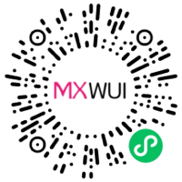

# MXWUI 微信小程序UI组件库
MXWUI是一套基于微信小程序原生语法开发的UI组件库，涵盖日常开发中常见的页面组件，按钮组件、图标组件、导航类组件、表单类组件、列表类组件、弹窗类组件等。

### 软件架构
微信小程序原生开发，支持 less，使用 gulp 打包。

### MXWUI优势
- 简单易用，上手快
- API文档详细
- 支持按需使用
- 组件间组合方便
- UI颜色主题支持配置
- 组件可高度定制化
- 模版示例丰富

### 扫码体验


### 使用教程
直接将 `dist/components/mxwui` 目录下的文件拷到你自己的项目中，放入你自己项目的 `components` 公共组件目录里面。

MXWUI组件文档：[查看文档](./docs/components.md)

#### 安装教程

```
yarn
```

##### 测试环境

```
yarn start
```

##### 生产环境

```
yarn build
```