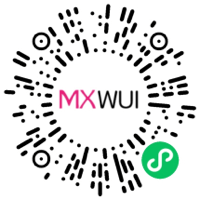

# Icon 图标组件

共有 203 个图标，涵盖日常使用需求，可自定义颜色、自定义大小。



扫码查看示例

## 基础用法
页面 `.json` 文件 `usingComponents` 中引入组件
```json
// json
{
    "usingComponents": {
        "mx-btn": "/components/mxwui/icon/index"
    }
}
```

页面 `.wxml` 文件中使用组件
```html
<mx-icon name="home" color="" size="" />
```

## 更多用法示例
### # 图标名称 name
属性：`name`，只支持图标库中图标

```html
<mx-icon name="home" />
```

### # 图标颜色 color
属性：`color`，图标颜色，默认 `#040A23`，支持任何合法的颜色值。

```html
<mx-icon color="#f00" />
```

### # 图标大小 size
属性：`size`，图标大小，默认 `48`，不带单位，使用rpx。

```html
<mx-icon size="32" />
```

<!-- ## 参数示意图
 -->

## 参数
|参数|类型|必填|可选值|默认值|参数描述|
|----|----|----|----|----|----|
|name|String|是|图标库图标名||图标名称，只支持图标库中图标|
|color|String||颜色值|`#040A23`|图标颜色，支持任何合法的颜色值|
|size|String||数字|`48`|图标大小，不带单位，使用rpx|

## 图标列表


## 其他说明
无