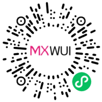

# Textarea 文本域组件

适用于长文本输入的场景，基于微信小程序的 `textarea` 组件开发。



扫码查看示例

## 基础用法
页面 `.json` 文件 `usingComponents` 中引入组件
```json
// json
{
    "usingComponents": {
        "mx-textarea": "/components/mxwui/textarea/index"
    }
}
```

页面 `.wxml` 文件中使用组件
```html
<mx-textarea bind:textarea_change="textareaChange" />
```

## 更多用法示例
### # 文本域样式类型 styleType
属性：`styleType`，可选 `normal`、`web`，默认 `normal`。

- 样式一 `normal`
```html
<mx-textarea />

<mx-textarea styleType="normal" />
```

- 样式二 `web`
```html
<mx-textarea styleType="web" />
```

### # 内容 value
属性：`value`，初始化或输入后内容。

```html
<mx-textarea value="123ABCabc内容" />
```

### # 文本颜色 textColor
属性：`textColor`，默认 `#040A23`，支持任何合法的颜色值。
```html
<mx-textarea textColor="#1677FF" />
```

### # 占位文本 placeholder
属性：`placeholder`，默认 `请输入`。

```html
<mx-textarea placeholder="请输入内容" />
```

### # 占位文本色 placeholderColor
属性：`placeholderColor`，默认 `#9AA0B1`，支持任何合法的颜色值。

```html
<mx-textarea placeholderColor="#1677FF" />
```

### # 背景色 bgColor
属性：`bgColor`，默认 `#FFFFFF`，支持任何合法的颜色值。

```html
<mx-textarea bgColor="#1677FF" />
```

### # 是否禁用 disabled
属性：`disabled`，可选 `true`、`false`，默认 `false` 不禁用。

- 禁用
```html
<mx-textarea disabled />

<mx-textarea disabled="{{true}}" />
```

- 不禁用
```html
<mx-textarea />

<mx-textarea disabled="{{false}}" />
```

### # 最大输入长度 maxLength
属性：`maxLength`，默认 `140`，数字。

设置为 `-1` 的时候不限制最大长度。

```html
<mx-textarea maxLength="10" />
```

### # 是否显示字数限制 showLimit
属性：`showLimit`，可选 `true`、`false`，默认 `true`。

需要配合 `maxLength` 使用，如果 `maxLength` 值设为 `-1`，则最大字符显示 `999`

- 显示字符数限制
```html
<mx-textarea />

<mx-textarea showLimit />

<mx-textarea showLimit="{{true}}" />
```

- 不显示字符数限制
```html
<mx-textarea showLimit="{{false}}" />
```

### # 自动聚焦 autoFocus
属性：`autoFocus`，可选 `true`、`false`，默认 `false`。

- 不自动聚焦
```html
<mx-textarea />

<mx-textarea autoFocus="{{false}}" />
```

- 自动聚焦
```html
<mx-textarea autoFocus />

<mx-textarea autoFocus="{{true}}" />
```

### # 是否自动增高 autoHeight
属性：`autoHeight`，可选 `true`、`false`，默认 `false`。

- 不自动增高
```html
<mx-textarea />

<mx-textarea autoHeight="{{false}}" />
```

- 自动增高
```html
<mx-textarea autoHeight />

<mx-textarea autoHeight="{{true}}" />
```

### # 自定义高度 height
属性：`height`，默认 `120`，数字，不带单位，使用rpx。

默认高度大概在 2 行左右。

字段 `autoHeight` 设为 `true` 时，自定义高度无效。

```html
<mx-textarea height="140" />
```

### # 指定光标与键盘的距离 cursorSpacing
属性：`cursorSpacing`，默认 `0`，数字。

```html
<mx-textarea cursorSpacing="0" />
```

### # 指定focus时的光标位置 cursor
属性：`cursor`，默认 `-1`，数字。

```html
<mx-textarea cursor="10" />
```

### # 光标起始位置 selectionStart
属性：`selectionStart`，默认 `-1`，数字。

自动聚集时有效，需与 selectionEnd 搭配使用。

```html
<mx-textarea selectionStart="-1" />
```

### # 光标结束位置 selectionEnd
属性：`selectionEnd`，默认 `-1`，数字。

自动聚集时有效，需与 selectionStart 搭配使用。

```html
<mx-textarea selectionEnd="-1" />
```

### # 键盘弹起时，是否自动上推页面 adjustPosition
属性：`adjustPosition`，可选 `true`、`false`，默认 `true`。

- 自动上推
```html
<mx-textarea />

<mx-textarea adjustPosition />

<mx-textarea adjustPosition="{{true}}" />
```

- 不上推
```html
<mx-textarea adjustPosition="{{false}}" />
```

### # focus时，点击页面的时候不收起键盘 holdKeyboard
属性：`holdKeyboard`，可选 `true`、`false`，默认 `false`。

- 收起键盘
```html
<mx-textarea holdKeyboard />

<mx-textarea holdKeyboard="{{true}}" />
```

- 不收起键盘
```html
<mx-textarea />

<mx-textarea holdKeyboard="{{false}}" />
```

### # 是否去掉 iOS 下的默认内边距 disableDefaultPadding
属性：`disableDefaultPadding`，可选 `true`、`false`，默认 `true`。

- 去掉
```html
<mx-textarea />

<mx-textarea disableDefaultPadding />

<mx-textarea disableDefaultPadding="{{true}}" />
```

- 不去掉
```html
<mx-textarea disableDefaultPadding="{{false}}" />
```

### # 设置键盘右下角按钮的文字 confirmType
属性：`confirmType`，可选 `send`、`search`、`next`、`go`、`done`、`return`，默认 `return` 换行。

- `send`，右下角按钮为“发送”
```html
<mx-textarea confirmType="send" />
```

- `search`，右下角按钮为“搜索”
```html
<mx-textarea confirmType="search" />
```

- `next`，右下角按钮为“下一个”
```html
<mx-textarea confirmType="next" />
```

- `go`，右下角按钮为“前往”
```html
<mx-textarea confirmType="go" />
```

- `done`，右下角按钮为“完成”
```html
<mx-textarea confirmType="done" />
```

- `return`，右下角按钮为“换行”，默认文案
```html
<mx-textarea confirmType="return" />
```

### # 点击键盘右下角按钮时是否保持键盘不收起 confirmHold
属性：`confirmHold`，可选 `true`、`false`，默认 `false`。

- 键盘不收起
```html
<mx-textarea confirmHold />

<mx-textarea confirmHold="{{true}}" />
```

- 键盘收起
```html
<mx-textarea />

<mx-textarea confirmHold="{{false}}" />
```


### # 键盘对齐位置 adjustKeyboardTo
属性：`adjustKeyboardTo`，可选 `cursor` 对齐光标位置、`bottom` 对齐输入框底部，默认 `cursor`。

- `cursor` 对齐光标位置，默认
```html
<mx-textarea adjustKeyboardTo="cursor" />
```

- `bottom` 对齐输入框底
```html
<mx-textarea adjustKeyboardTo="bottom" />
```

### # 描述 desc
属性：`desc`，辅助性说明文案或用于错误提示。

```html
<mx-textarea desc="描述内容" />
```

### # 描述文本色 descColor
属性：`descColor`，默认 `#9AA0B1`，支持任何合法的颜色值。

```html
<mx-textarea descColor="#1677FF" />
```

### # 左侧自定义宽度 leftWidth
属性：`leftWidth`，数字，不带单位，默认使用rpx。

当 `styleType == 'horizontal'` 和 `styleType == 'web'` 时有效。
```html
<mx-textarea leftWidth="200" />
```

### # 标签文案 label
属性：`label`，常用于表单填写项的名称。
```html
<mx-textarea label="标签文案" />
```

### # 标签文案文本色 labelColor
属性：`labelColor`，默认 `#040A23`，支持任何合法的颜色值。

需要配合 `label` 属性一起使用
```html
<mx-textarea labelColor="#1677FF" />
```

### # 文案对齐方式 labelAlign
属性：`labelAlign`，可选值：`left`、`center`、`right`，默认 `left`，左对齐。

需要配合 `label` 属性一起使用
- 左对齐
```html
<mx-textarea />

<mx-textarea labelAlign="left" />
```

- 居中对齐
```html
<mx-textarea labelAlign="center" />
```

- 右对齐
```html
<mx-textarea labelAlign="right" />
```

### # 是否显示必填星号 required
属性：`required`，默认值 `false` 不显示必填星号。

- 显示星号
```html
<mx-textarea required />

<mx-textarea required="{{true}}" />
```

- 不显示星号
```html
<mx-textarea required="{{false}}" />

<mx-textarea />
```

### # 必填星号位置 requiredPosition
属性：`requiredPosition`，可选值 `left`、`right`，默认值 `right` 在标签文本后面。

- 星号在标签后
```html
<mx-textarea required />

<mx-textarea required requiredPosition />

<mx-textarea required requiredPosition="right" />
```

- 星号在标签前
```html
<mx-textarea required requiredPosition="left" />
```

### # 标签前图标 firstIcon
属性：`firstIcon`，对象，可以自定义图标或图片，自定义图标大小和颜色。

参数：`iconName`，图标名称，只支持图标库的图标。

参数：`iconColor`，图标颜色，默认 `#040A23`，任何合法的颜色值。

参数：`iconUrl`，自定义图片地址，传入则不使用 `iconName` 和 `iconColor`。

参数：`iconSize`，图标/图片大小，默认 `48`，不带单位，默认使用 rpx。

事件：`bind:textarea_firstIcon`，标签前图标点击事件。

```js
// js
data: {
    firstIcon: {
        iconName: '图标名',
        iconColor: '#1677FF',
        iconUrl: 'http://cdn.mingsixue.com/xcx/MXWUI/hot.png',
        iconSize: 48
    },
}
```

```html
<mx-textarea firstIcon="{{firstIcon}}" bind:textarea_firstIcon="事件函数" />
```

### # 标签后图标 lastIcon
属性：`lastIcon`，对象，可以自定义图标或图片，自定义图标大小和颜色。

参数：`iconName`，图标名称，只支持图标库的图标。

参数：`iconColor`，图标颜色，默认 `#9AA0B1`，任何合法的颜色值。

参数：`iconUrl`，自定义图片地址，传入则不使用 `iconName` 和 `iconColor`。

参数：`iconSize`，图标/图片大小，默认 `32`，不带单位，默认使用 rpx。

事件：`bind:textarea_lastIcon`，标签后图标点击事件。

```js
// js
data: {
    lastIcon: {
        iconName: '图标名',
        iconColor: '#1677FF',
        iconUrl: 'http://cdn.mingsixue.com/xcx/MXWUI/hot.png',
        iconSize: 32
    },
}
```

```html
<mx-textarea lastIcon="{{lastIcon}}" bind:textarea_lastIcon="事件函数" />
```

### # 是否横向布局 horizontal
属性：`horizontal`，默认值 `false`，默认纵向布局。

当 `styleType == 'web'` 时有效。

- 横向
```html
<mx-textarea horizontal />

<mx-textarea horizontal="{{true}}" />
```

- 纵向
```html
<mx-textarea />

<mx-textarea horizontal="{{false}}" />
```

## 自定义事件
事件：`bind:textarea_change`，值变更回调事件，返回 `event.detail` 里返回字段 `value`、`cursor`、 `keyCode`。

事件：`bind:textarea_focus`，获取焦点回调事件，返回 `event.detail` 里返回字段 `value`、`height`。

事件：`bind:textarea_blur`，失去焦点回调事件，返回 `event.detail` 里返回字段 `value`、`cursor`。

事件：`bind:textarea_line_change`，行高变更回调事件，返回 `event.detail` 里返回字段 `height`、`heightRpx`、`lineCount`。

事件：`bind:textarea_confirm`，点击完成时回调事件，返回 `event.detail` 里返回字段 `value`。

事件：`bind:textarea_keyboard_height_change`，键盘高度发生变化的回调事件，返回 `event.detail` 里返回字段 `height`、`duration`。

`height` 为键盘高度。

```html
<mx-xxx 
    bind:textarea_change="handleChange" 
    bind:textarea_focus="handleFocus"
    bind:textarea_blur="handleBlur"
    bind:textarea_line_change="handleLineChange"
    bind:textarea_confirm="handleConfirm"
    bind:textarea_keyboard_height_change="handleKeyboardHeightChange"
/>
```

<!-- ## 参数示意图
 -->

## 参数
|参数|类型|必填|可选值|默认值|参数描述|
|----|----|----|----|----|----|
|styleType|String|必填|`normal`、`web`|`normal`|文本域样式类型|
|value|String||||内容|
|textColor|String||颜色值|`#040A23`|文本颜色，支持任何合法的颜色值|
|placeholder|String|||`请输入`|占位文本|
|placeholderColor|String||颜色值|`#9AA0B1`|占位文本色，支持任何合法的颜色值|
|bgColor|String||颜色值|`#FFFFFF`|bgColor，支持任何合法的颜色值|
|disabled|Boolean||`true`、`false`|`false`|是否禁用|
|maxLength|Number||数字|`-1`|最大输入长度，设置为 -1 的时候不限制最大长度|
|showLimit|Boolean||`true`、`false`|`true`|是否显示字数限制，需要和 `maxLength` 配合使用|
|autoFocus|Boolean||`true`、`false`|`false`|自动聚焦|
|autoHeight|Boolean||`true`、`false`|`false`|是否自动增高|
|height|Number||数字|`120`|自定义高度，不带单位，默认使用rpx；`autoHeight` 设为 `true` 时，自定义高度无效|
|cursorSpacing|Number||数字|`0`|指定光标与键盘的距离|
|cursor|Number||数字|`-1`|指定focus时的光标位置|
|selectionStart|Number||数字|`-1`|光标起始位置，自动聚集时有效，需与selectionEnd搭配使用|
|selectionEnd|Number||数字|`-1`|光标结束位置，自动聚集时有效，需与selectionStart搭配使用|
|adjustPosition|Boolean||`true`、`false`|`true`|键盘弹起时，是否自动上推页面|
|holdKeyboard|Boolean||`true`、`false`|`false`|focus时，点击页面的时候不收起键盘|
|disableDefaultPadding|Boolean||`true`、`false`|`true`|是否去掉 iOS 下的默认内边距|
|confirmType|String||`send` 发送、`search` 搜索、`next` 下一个、`go` 前往、`done` 完成、`return` 换行|`return`|设置键盘右下角按钮的文字|
|confirmHold|Boolean||`true`、`false`|`false`|点击键盘右下角按钮时是否保持键盘不收起|
|adjustKeyboardTo|String||`cursor` 对齐光标位置、`bottom` 对齐输入框底部|`cursor`|键盘对齐位置|
|desc|String||||描述|
|descColor|String||颜色值|`#9AA0B1`|描述文本色，支持任何合法的颜色值|
|label|String|是|||标签文案|
|labelColor|String||颜色值||标签文案文本色，任何合法的颜色值|
|required|Boolean||`true`、`false`|`false`|是否必填|
|requiredPosition|String||`left`、`right`|`right`|必填星号位置|
|firstIcon|Object||||标签前图标|
|lastIcon|Object||||标签后图标|

### styleType="web"
|参数|类型|必填|可选值|默认值|参数描述|
|----|----|----|----|----|----|
|leftWidth|Number||数字||左侧自定义宽度，不带单位，默认使用rpx|
|labelAlign|String||`left`、`center`、`right`|`left`|标签对齐方式|
|horizontal|Boolean||`true`、`false`|`false`|是否横向布局|

### firstIcon
|参数|类型|默认值|参数描述|
|----|----|----|----|
|iconName|String||图标名称，只支持图标库中图标|
|iconColor|String|`#040A23`|图标颜色，任何合法的颜色值|
|iconUrl|String||图标图片地址，传入则 `iconName`、`iconColor` 无效|
|iconSize|Number|`48`|图标大小，不带单位，默认rpx|

### lastIcon
|参数|类型|默认值|参数描述|
|----|----|----|----|
|iconName|String||图标名称，只支持图标库中图标|
|iconColor|String|`#9AA0B1`|图标颜色，任何合法的颜色值|
|iconUrl|String||图标图片地址，传入则 `iconName`、`iconColor` 无效|
|iconSize|Number|`32`|图标大小，不带单位，默认rpx|

## 事件
|事件名称|类型|返回值|事件说明|
|----|----|----|----|
|bind:textarea_change|Change|`event.detail`|值变更回调事件，返回 `event.detail` 里返回字段 `value`、`cursor`、 `keyCode`|
|bind:textarea_focus|Focus|`event.detail`|获取焦点回调事件，返回 `event.detail` 里返回字段 `value`、`height`|
|bind:textarea_blur|Blur|`event.detail`|`event.detail` 里返回字段 `value`、`cursor`|
|bind:textarea_line_change|Change|`event.detail`|行高变更回调事件，返回 `event.detail` 里返回字段 `height`、`heightRpx`、`lineCount`|
|bind:textarea_confirm|Change|`event.detail`|点击完成时回调事件，返回 `event.detail` 里返回字段 `value`|
|bind:textarea_keyboard_height_change|Change|`event.detail`|键盘高度发生变化的回调事件，返回 `event.detail` 里返回字段 `height`、`duration`|
|bind:textarea_firstIcon|Click||标签前图标点击事件|
|bind:textarea_lastIcon|Click||标签后图标点击事件|

## 其他说明
- 微信小程序文档：https://developers.weixin.qq.com/miniprogram/dev/component/textarea.html